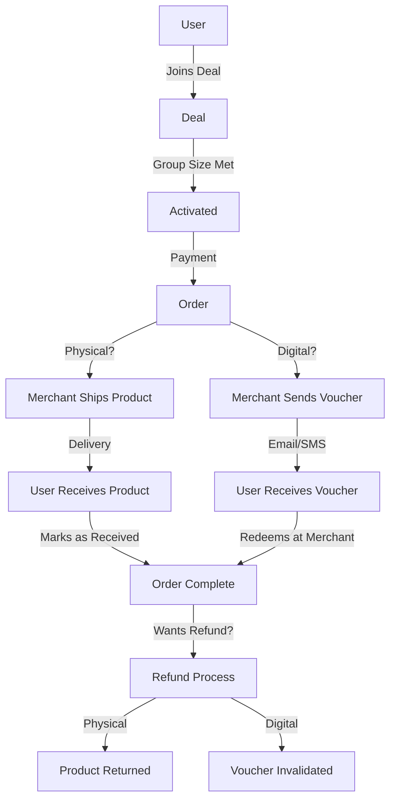

# Kuponna Project: Detailed Flows & Explanations

This document provides a comprehensive, step-by-step breakdown of the Admin, Merchant, and User flows in the Kuponna platform, with special focus on the order, voucher, and redemption card processes for both digital and physical products.

---

## 1. Admin Flow

**1. Login & Dashboard**
- Admin logs in and accesses the dashboard, which displays analytics and system status.

**2. Merchant Management**
- When a new merchant registers, the admin reviews their details.
- If verification passes, the admin approves the merchant; otherwise, the application is rejected.

**3. Deal Management**
- When a merchant submits a new deal, the admin reviews the details.
- If the deal follows platform guidelines, the admin publishes it; otherwise, the merchant is notified of rejection.

**4. User Complaints & Refunds**
- Admin reviews user complaints or refund requests.
- If valid, the admin investigates and processes the refund, notifying both merchant and user.
- If not valid, the request is rejected and the user is notified.

**5. Platform Issues**
- If a platform issue is detected, the admin escalates it to technical support.

**6. Redemption Card Orders**
- If there are Redemption Card orders, the admin views and ships them via delivery personnel.
- Admin updates tracking status and notifies both user and merchant.

**7. Logout**
- Admin logs out.

---

## 2. Merchant Flow

**1. Registration & Approval**
- Merchant registers and provides business details.
- Admin verifies and approves the merchant.

**2. Dashboard & Deal Creation**
- Merchant accesses dashboard and creates a new deal, setting title, price, discount, and minimum group size.
- Merchant uploads images and submits the deal for admin approval.

**3. Deal Approval & Publishing**
- If admin approval is required, the deal is reviewed and approved.
- Once approved, the deal is published in the marketplace.

**4. Deal Progress & Activation**
- Users join the deal. If the minimum group size is not met, the merchant is notified of progress.
- Once the group size is met, the deal is activated and users make payments.

**5. Order Generation & Fulfillment**
- Orders are generated for the merchant.
- If a user requests a Redemption Card, the merchant tracks its delivery status.
- For physical products: Merchant ships the product.
- For digital products: Merchant generates a digital voucher and delivers it via email/SMS.

**6. Payout & Transactions**
- Merchant receives payout and tracks earnings and transactions.

**7. Customer Service & Refunds**
- Merchant responds to customer inquiries.
- If a refund request is received, the merchant reviews and approves/rejects it.
- If approved, the refund is processed and the voucher is invalidated if digital.

---

## 3. User Flow

**1. Registration & Dashboard**
- User registers, provides details, and verifies email.
- User accesses dashboard and browses deals.

**2. Deal Selection & Group Purchase**
- User filters/searches deals and selects one.
- User can join an existing group or create a new one for group deals.
- User invites others to join; if group size is not met, user is notified of progress.

**3. Checkout & Payment**
- Once group size is met, user proceeds to checkout and makes payment.
- If an invoice is needed, the system generates it.

**4. Redemption Card Request**
- If desired, user requests a Redemption Card.
- User receives a tracking link and confirms receipt upon delivery.

**5. Order Fulfillment**
- For physical products: User receives the product shipped by the merchant.
- For digital products: User receives a digital coupon or Redemption Card via email/SMS and redeems it at the merchant location.
- User marks the order as received.

**6. Order Management**
- User can cancel the order and receive a refund if eligible.
- User can contact support or raise a complaint if there is an issue.

---

## 4. Orders, Vouchers, and Redemption Cards: How They Work

### Order Flow (Physical vs. Digital)

| Step                | Physical Product Flow                                   | Digital Product Flow                                  |
|---------------------|--------------------------------------------------------|-------------------------------------------------------|
| User joins deal     | User joins or creates group, waits for group to fill    | User joins or creates group, waits for group to fill   |
| Deal activation     | Once group size met, deal is activated                  | Once group size met, deal is activated                 |
| Payment             | User pays for the deal                                  | User pays for the deal                                 |
| Order generated     | Order is created for merchant                           | Order is created for merchant                          |
| Fulfillment         | Merchant ships product                                  | Merchant generates digital voucher                     |
| Delivery            | User receives product via delivery                      | User receives voucher via email/SMS                    |
| Redemption          | User marks order as received                            | User redeems voucher at merchant location              |
| Refund (if needed)  | Product returned, refund processed                      | Voucher invalidated, refund processed                  |

### Redemption Card
- A Redemption Card is a special card (physical or digital) that allows the user to redeem a deal at a merchant location.
- Users can request a Redemption Card after purchase.
- Admin or merchant ships the card (physical) or sends a digital version.
- User tracks delivery and confirms receipt.
- At redemption, the card is marked as used.

### Voucher
- A voucher is a digital code or document sent to the user for digital deals.
- Delivered via email or SMS.
- Used at the merchant location to claim the deal.
- If a refund is processed, the voucher is invalidated to prevent misuse.

### Group Purchase
- Some deals require a minimum number of users to join (group purchase).
- Users can invite others to join.
- Once the group is full, the deal is activated and orders are processed.

### Refunds & Complaints
- Users can request refunds or raise complaints.
- Admin and merchant review and process these requests.
- For digital products, vouchers are invalidated upon refund.
- For physical products, the product may need to be returned.

---

## 5. Visual Summary

---

If you need further breakdowns or have questions about any specific part, let me know!
